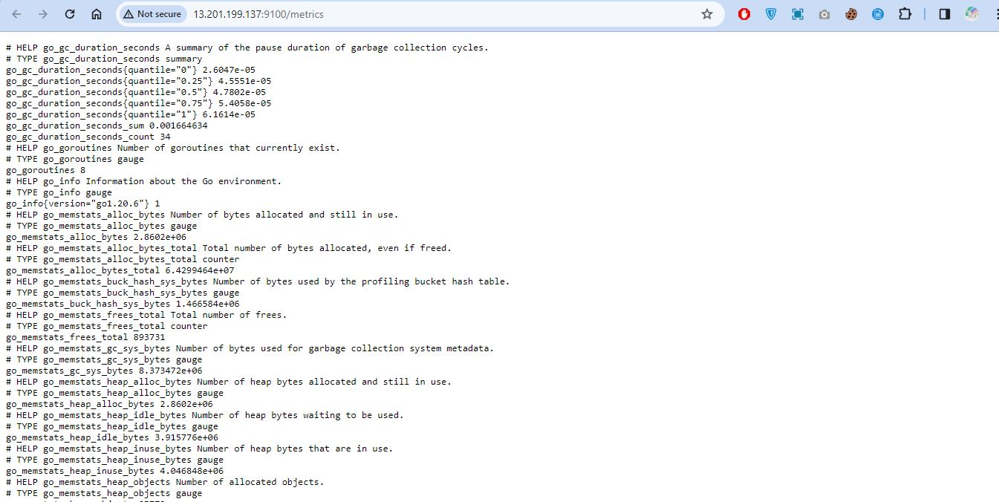

# Netflix CI/CD Pipeline with Docker Deployment

This repository contains a CI/CD pipeline for automating the deployment of a Netflix application using Docker. The pipeline is designed to streamline the process of building, testing, and deploying the Netflix application while ensuring code quality and security.
## Deployed 

## Tools Used

- **Server #1 (AWS EC2 T2Large):**
  - Jenkins
  
  - SonarQube
  
  - Docker
  

- **Server #2 (AWS EC2 T2Medium):**
  - Prometheus
  
  - node_exporter
  
  - Grafana
  

## Pipeline Overview

The pipeline is structured with the following stages:

1. **Clean Workspace:** Clears the workspace before starting the build process.
2. **Checkout from Git:** Retrieves the source code from the GitHub repository.
3. **Sonarqube Analysis:** Performs code analysis using SonarQube for quality and security checks.
4. **Quality Gate:** Waits for the SonarQube quality gate to pass before proceeding.
5. **Install Dependencies:** Installs npm dependencies for the Netflix application.
6. **OWASP FS SCAN:** Conducts dependency scanning using OWASP Dependency-Check.
7. **TRIVY FS SCAN:** Scans the filesystem for vulnerabilities using Trivy.
8. **Docker Build & Run:** Builds the Docker image for the Netflix application and runs it.
9. **TRIVY:** Scans the Docker image for vulnerabilities using Trivy.

## Usage

To use this pipeline, follow these steps:

1. Set up Server #1 (AWS EC2 T2Large) with Jenkins, SonarQube, and Docker installed.
2. Set up Server #2 (AWS EC2 T2Medium) with Prometheus, node_exporter, and Grafana installed.
3. Configure Jenkins with appropriate credentials and plugins.
4. Create a new pipeline job in Jenkins.
5. Copy and paste the provided pipeline code into the Jenkinsfile of the pipeline job.
6. Update the GitHub repository URL in the "Checkout from Git" stage.
7. Update any environment variables or build arguments as needed.
8. Save the pipeline job configuration.
9. Trigger the pipeline to start the build process.

**Note:** Ensure that all necessary plugins, dependencies, and configurations are properly set up in Jenkins, SonarQube, and Docker for the pipeline to run successfully.

This CI/CD pipeline automates the deployment process of the Netflix application, ensuring code quality, security, and reliability throughout the development lifecycle.

| Ports            | Tool Used        |
|------------------|------------------|
|     8081             |    Netflix              |
|     8080             |    Jenkins              |
|     9000             |    Sonarqube            |
|     3000             |    Grafana              |
|     9090             |    Prometheus           |
|     9100             |    Node Exporter        |

## Ports Use

## Reference 
Github Repo: https://github.com/N4si/DevSecOps-Project/